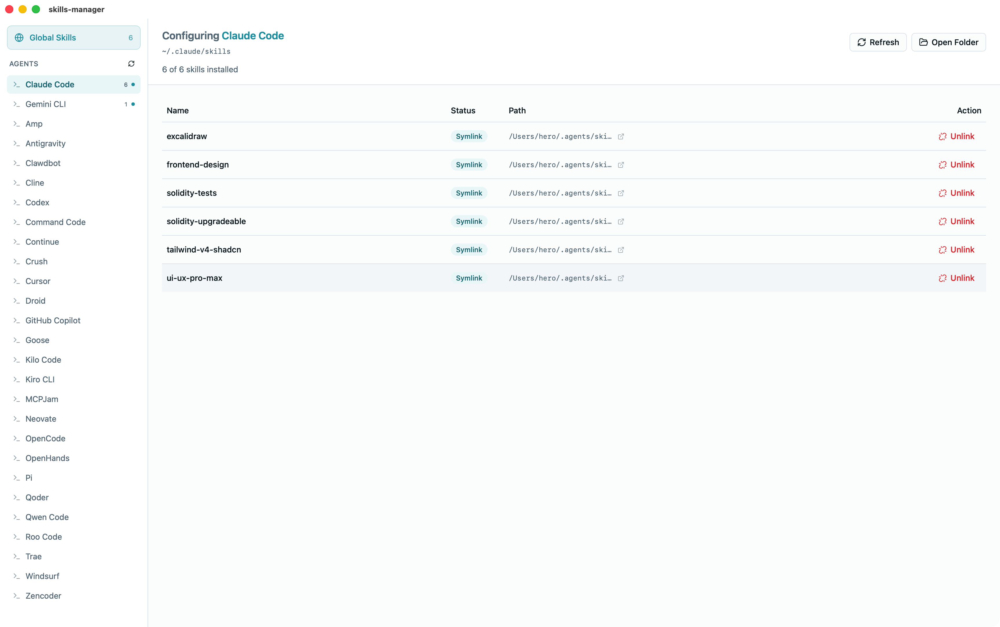

# Skills Manager

A desktop application for managing AI agent skills across multiple coding assistants. Built with Tauri, React, and TypeScript.

## Download

Download the latest version from [GitHub Releases](https://github.com/user/skills-manager/releases):

| Platform | Download |
|----------|----------|
| macOS (Apple Silicon) | `.dmg` (aarch64) |
| macOS (Intel) | `.dmg` (x64) |
| Windows | `.msi` / `.exe` |
| Linux | `.deb` / `.AppImage` |

## Overview

Skills Manager helps you organize and distribute skills (reusable instruction sets) across various AI coding assistants. Instead of manually copying skill folders to each agent's directory, you can manage everything from a single interface.


### Getting Started with Skills

The easiest way to get skills is from [skills.sh](https://skills.sh/):

```bash
# Install a skill directly to ~/.agents/skills
npx skills add <skill-name>

# Example
npx skills add tailwind-v4-shadcn
```

Skills installed via `npx skills add` are automatically placed in the global skills directory (`~/.agents/skills`), ready to be linked to any agent through Skills Manager.

### Key Features

- Centralized skill management in `~/.agents/skills`
- Link/unlink skills to multiple agents via symlinks
- Auto-detect installed AI agents
- View and manage local skills per agent
- Upload local skills to global directory

## Supported Agents

Skills Manager supports 27 AI coding assistants:

| Agent | Skills Directory |
|-------|-----------------|
| Amp | `~/.config/agents/skills` |
| Antigravity | `~/.gemini/antigravity/global_skills` |
| Claude Code | `~/.claude/skills` |
| Clawdbot | `~/.clawdbot/skills` |
| Cline | `~/.cline/skills` |
| Codex | `~/.codex/skills` |
| Command Code | `~/.commandcode/skills` |
| Continue | `~/.continue/skills` |
| Crush | `~/.config/crush/skills` |
| Cursor | `~/.cursor/skills` |
| Droid | `~/.factory/skills` |
| Gemini CLI | `~/.gemini/skills` |
| GitHub Copilot | `~/.copilot/skills` |
| Goose | `~/.config/goose/skills` |
| Kilo Code | `~/.kilocode/skills` |
| Kiro CLI | `~/.kiro/skills` |
| MCPJam | `~/.mcpjam/skills` |
| Neovate | `~/.neovate/skills` |
| OpenCode | `~/.config/opencode/skills` |
| OpenHands | `~/.openhands/skills` |
| Pi | `~/.pi/agent/skills` |
| Qoder | `~/.qoder/skills` |
| Qwen Code | `~/.qwen/skills` |
| Roo Code | `~/.roo/skills` |
| Trae | `~/.trae/skills` |
| Windsurf | `~/.codeium/windsurf/skills` |
| Zencoder | `~/.zencoder/skills` |

## Getting Skills

### From skills.sh (Recommended)

[skills.sh](https://skills.sh/) is the official skill registry. Use the CLI to install skills directly:

```bash
# Install a skill
npx skills add <skill-name>

# Examples
npx skills add tailwind-v4-shadcn
npx skills add ui-ux-pro-max
```

Skills are installed to `~/.agents/skills` and can be linked to any agent via Skills Manager.

### Manual Installation

For skills from other sources (GitHub, custom skills, etc.), manually copy the skill folder:

```bash
cp -r /path/to/skill ~/.agents/skills/
```

## Usage

### Global Skills View

The main view shows all skills in your global directory (`~/.agents/skills`):

- **Link**: Create symlinks to selected agents
- **Unlink**: Remove symlinks from selected agents
- **Open Folder**: Open the global skills directory in Finder/Explorer

### Agent Detail View

Click on an agent in the sidebar to see:



- **Symlinked skills**: Skills linked from global directory (can unlink)
- **Local skills**: Skills stored directly in agent's folder (can delete or upload to global)
- **Available skills**: Global skills not yet linked (can link)

### Skill Actions

| Action | Description |
|--------|-------------|
| Link | Create symlink from global to agent's skills directory |
| Unlink | Remove symlink (keeps original in global) |
| Delete | Remove local skill from agent (not recoverable) |
| Upload to Global | Copy local skill to global directory |

## Development

### Prerequisites

- [Node.js](https://nodejs.org/) (v18+)
- [pnpm](https://pnpm.io/)
- [Rust](https://www.rust-lang.org/tools/install)
- [Tauri CLI](https://tauri.app/start/prerequisites/)

### Setup

```bash
# Install dependencies
pnpm install

# Run in development mode
pnpm tauri dev

# Build for production
pnpm tauri build
```

### Scripts

| Command | Description |
|---------|-------------|
| `pnpm dev` | Start Vite dev server (web only) |
| `pnpm tauri dev` | Start Tauri app in development mode |
| `pnpm build` | Build frontend |
| `pnpm tauri build` | Build production app |
| `pnpm test` | Run tests |
| `pnpm test:watch` | Run tests in watch mode |

### Tech Stack

- **Frontend**: React 19, TypeScript, Tailwind CSS v4, shadcn/ui
- **Backend**: Rust, Tauri v2
- **Testing**: Vitest, fast-check (property-based testing)

## How It Works

Skills Manager uses symlinks to share skills between agents:

```
~/.agents/skills/           # Global skills directory
├── my-skill/
│   └── SKILL.md
└── another-skill/
    └── SKILL.md

~/.cursor/skills/           # Cursor's skills directory
├── my-skill -> ~/.agents/skills/my-skill  # Symlink
└── local-skill/            # Local skill (not symlinked)
```

When you "link" a skill, the app creates a symlink from the agent's skills directory to the global skill. This means:
- One source of truth for each skill
- Updates to global skills are immediately available to all linked agents
- Unlinking removes only the symlink, not the original skill

## License

MIT
